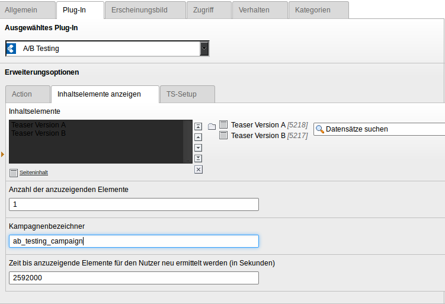

Users manual
============

You have to provide a campaign identifier, the set of possible content elements, how many elements should be shown to the user and how long the content elements should stay the same for a user. The content elements should not be referenced in the page itself. Otherwise they would all be displayed. Instead they should only be visible in the list module. The display of the elements is done with the plugin.

The plugin selects the elements to be shown from that set of content elements. The selection is made evenly distributed. The elements that have be shown the least are selected first.

To analyse and track the user experience you could use tools like piwik. For example every content element could have a link with a specific piwik variable. So you can track how often the page was displayed and how often users clicked links in all teasers. If you don't know how you could do it, don't hestitate to contact at <dev@dmk-ebusiness.de>.

Installation
------------

Install the extension with the Extension Manager.

Include the static TypoScript Template.

Insert the plugin with the action to show content elements.
