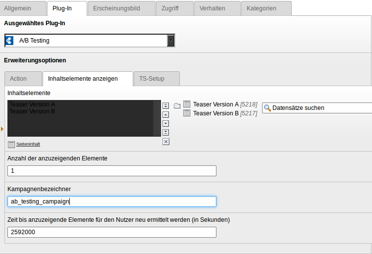

.. ==================================================
.. FOR YOUR INFORMATION
.. --------------------------------------------------
.. -*- coding: utf-8 -*- with BOM.

.. include:: ../Includes.txt

.. _users-manual:

Users manual
============

You have to provide an campaign identifier, the set of content elements,
how many elements should be shown and how long the content elements should stay
the same for a user.

The plugin selects the elements to be shown from that set of content elements. The
selection is made evenly distributed.

.. _installation:

Installation
------------

Install the extension with the Extension Manager.

Include the static TypoScript Template.

Insert the plugin with the action to show content elements.